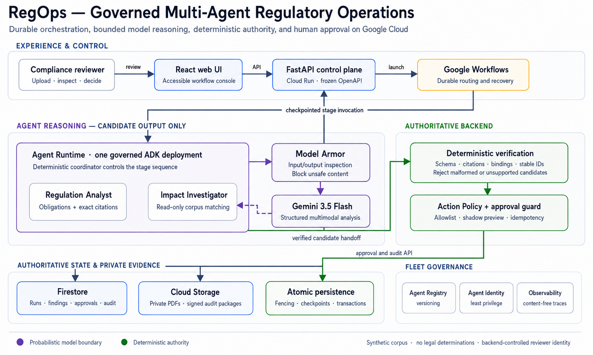

# RegOps — From Rule Change to Resolved Action

**All Things Agentic Hackathon · Taskmaster track**

## 1. Project overview

RegOps is a secure multi-agent system that turns regulatory changes into evidence-backed findings, approved actions, deterministic revalidation, and complete audit trails on Google Cloud.

That describes the product target. The implementation boundary below matters when reproducing this branch.

- The demonstration uses **synthetic data only**, not real contracts, cases, or people.
- RegOps **identifies potential conflicts and supports review**; it makes no legal determinations or guarantees of legal compliance.
- Consequential amendments require human approval. Approval produces an `APPROVED_DRAFT` against a synthetic contract's **shadow copy**, never a replacement of the source contract.
- Model output is not authoritative until deterministic verification succeeds. The live model-to-verifier pipeline is still planned.

## 2. Current implementation status

This guide describes `backend/phase-1b2-agent-worker`, with the Phase 1B.1 implementation and Phase 1B.2 specification. It does not claim a hosted deployment.

| Status | What exists on this branch |
| --- | --- |
| Implemented and locally testable | React console with eight views, synthetic mock workflow, approval/rejection, evidence, counterfactual and audit fixtures; HTTP adapter; FastAPI's eight frozen API operations; strict schemas; state/checkpoint services; SHA-256 change detection; three-action policy; approval guards; immutable sources and shadow snapshots; deterministic counterfactual service with an injected matcher; audit generation; offline tests. |
| Implemented cloud adapters; configuration required | Firestore repositories and transaction boundaries, private Cloud Storage source/audit adapter and audit URL signer, Google Workflows execution launcher, and `demo` runtime composition. Tests use fakes; no live cloud integration is certified here. |
| Phase 1B.2 specified, not implemented | Gemini extraction, bounded PDF parsing and citation verification, ADK Analyst/Investigator, one governed Agent Runtime worker, worker atomic stage handoff/recovery, corpus/evaluation fixtures, Model Armor, Registry, Agent Identity, Agent Observability, and real Workflow invocation/callback definitions. |
| Deferred production capabilities | Production authentication and trusted reviewer identity integration, production data governance/corpus, provisioning and final hosted demonstration. Cloud Run Jobs and Pub/Sub begin in Phase 2; Agent Gateway, Memory Bank, separate agent deployments and bonus models are not core requirements. |

The existing `OneDocumentOrchestrator` is a foundation tested with injected roles, **not** a working Gemini worker: its verification stage currently advances states rather than validating model citations. The counterfactual service exists, but default cloud composition supplies no matcher. See [backend details](backend/README.md), [implementation history](docs/backend-notes.md), and the [Phase 1B.2 specification](docs/phase-1b2-worker-spec.md).

## 3. Architecture

**Target architecture, not evidence of deployment:**



The existing diagram is included unchanged. Worker, model, governance, fencing, and Workflow lifecycle elements in it include planned capabilities.

| Component | Responsibility and current boundary |
| --- | --- |
| React + Vite + TypeScript frontend | Polls the adapter every two seconds; mock mode runs in the browser, HTTP mode calls FastAPI. |
| FastAPI control plane | Validates intake and decisions, serves findings/state/audit, and owns reviewer identity. Cloud Run container definition exists. |
| Google Workflows | Execution launcher exists. Durable worker routing, retries and approval callbacks are Phase 1B.2 targets; no Workflow YAML exists yet. |
| One ADK / Agent Runtime worker — planned | A deterministic coordinator with Regulation Analyst and Impact Investigator sub-agents; neither gets action or approval tools. |
| Gemini 3.5 Flash behind Model Armor — planned | Bounded structured extraction/investigation with input/output inspection. No implemented Gemini/ADK adapter, configured model identifier, or verified regional access yet. |
| Deterministic verification and `ActionPolicy` | Strict schemas, action allowlist, state guards and shadow comparison exist. Full citation/corpus verification and worker wiring remain planned; only the Action Controller executes actions. |
| Firestore | Authoritative persistent runs, findings, approvals, checkpoints and audit records in configured cloud mode; never replaced by agent session history. |
| Private Cloud Storage | Immutable run-scoped source uploads and generated audit packages; private bucket/IAM configuration is still required. |
| Human approval | Backend-controlled decision identity and atomic approval service exist; production authentication is not implemented. |
| Registry, Identity, observability — planned | Versioned deployment governance, least privilege, and content-free correlated traces; not working integrations on this branch. |

The integration boundary is [contracts/openapi.yaml](contracts/openapi.yaml): **eight operations and thirteen run states**, with polling rather than server push. [contracts/run-states.md](contracts/run-states.md) documents the state graph. The contract remains frozen.

Repository ownership remains unchanged: Claude owns `frontend/`; Codex owns `backend/`, `contracts/` and `infrastructure/`. See [AGENTS.md](AGENTS.md) and [CLAUDE.md](CLAUDE.md). Frontend contract requests go in `frontend/CONTRACT_REQUESTS.md`; deliberate contract changes must be announced in `docs/backend-notes.md`.

## 4. Prerequisites

| Tool | Repository requirement / verified environment |
| --- | --- |
| Python | **3.12.x only** (`>=3.12,<3.13` in `backend/pyproject.toml`). Container pins `3.12.10-slim-bookworm`; local checks used **3.12.13**. Do not substitute 3.11 or 3.13. |
| Node.js | Use the verified **24.16.0**. No root version pin exists. Required packages admit `^20.19.0 \|\| ^22.13.0 \|\| >=24`; the optional Linux x64/glibc `@napi-rs/lzma` package is stricter: `^22.20 \|\| ^24.12 \|\| >=25`. Node 24.16.0 satisfies both. |
| npm | No project `packageManager` or npm engine pin. Lockfile format is **3**, and locked Rollup declares npm `>=8.0.0`; use the verified **11.13.0** with Node 24.16.0 to reproduce these checks. |
| Git | Needed for cloning; no minimum pinned. Verified with **2.53.0.windows.2**. |
| Google Cloud CLI / credentials | Only for separately configured cloud mode; no CLI version is pinned. Not required for the mock UI or default backend tests. |
| Firestore Emulator | Optional integration test only. Requires a running Firestore Emulator and `FIRESTORE_EMULATOR_HOST`; no emulator launcher or Java/emulator version is pinned here. It does not replace Storage or Workflows. |

Dependency installation needs access to the npm and Python package registries. The mock demo and default backend tests need no Google credentials after installation.

## 5. Quickest judge path — no Google credentials

From a parent directory, in PowerShell or a macOS/Linux shell:

```sh
git clone https://github.com/Rahmat9009/RegOps-Agent.git
cd RegOps-Agent/frontend
npm ci
npm run dev -- --strictPort
```

On Windows, use `npm.cmd` in place of `npm` if PowerShell blocks the npm script. `--strictPort` makes a busy port an explicit error instead of silently changing the URL.

Open **[http://localhost:5173/](http://localhost:5173/)**. A fresh checkout defaults to `mock`; confirm the **mock adapter** label. No environment file, backend, emulator, or Google account is needed.

1. Open **Regulation intake**.
2. Click **Insert a synthetic sample document**.
3. Check **I confirm this document is synthetic**, then **Confirm and start analysis**.
4. Click **Open run detail**. The mock reaches `AWAITING_APPROVAL` in about 20 seconds, including one simulated recoverable failure during mapping.
5. Follow **Review proposed action**, inspect evidence and the shadow preview, and approve. The run records `EXECUTING → REVALIDATING → COMPLETED` and an `APPROVED_DRAFT`.
6. Start another intake and reject its amendment. It records `AWAITING_APPROVAL → COMPLETED` directly; the rejected amendment is not executed.

The button generates a browser-only placeholder named `synthetic-fee-rule-amendment.pdf`. It contains no extractable regulatory rule; the mock supplies fixed synthetic findings. **No standalone sample PDF exists in the repository.** A content-bearing synthetic PDF is still a blocker for a reproducible real extraction/upload demo, not for this mock path.

At verification time, the remote exposes `main`, not this local documentation/specification branch. Cloning was tested, and its `backend/`, `frontend/` and `contracts/` match this branch. The guide and diagram must be included in the eventual submitted revision; this task does not push them. Do not try to clone an unpublished branch.

## 6. Local backend setup

These steps install the package and offline tests. **They do not create an offline backend server or a complete analysis worker.** Start at the repository root in a new terminal; use a fresh `.venv` for reproducibility.

### Windows PowerShell

```powershell
cd backend
py -3.12 --version
py -3.12 -m venv .venv
. .\.venv\Scripts\Activate.ps1
python --version
python -m pip install --upgrade pip
python -m pip install -r requirements-dev.lock
python -m pip install --no-deps -e .
python -c "import regops_api; print(regops_api.__file__)"
```

Both version checks must report **3.12.x**. If the launcher cannot find 3.12, see troubleshooting; do not fall back to plain `python -m venv` outside the verified environment. If activation is blocked, use `.\.venv\Scripts\python.exe` for every subsequent `python` command instead of changing system security policy.

### macOS / Linux

```sh
cd backend
python3.12 --version
python3.12 -m venv .venv
. .venv/bin/activate
python --version
python -m pip install --upgrade pip
python -m pip install -r requirements-dev.lock
python -m pip install --no-deps -e .
python -c "import regops_api; print(regops_api.__file__)"
```

`requirements-dev.lock` pins runtime and development dependencies. Installing only that file does **not** install `regops_api`; the editable install adds `backend/src` to package resolution. The project declares a `dev` extra, but the lockfile process above is the reproducible path. The build dependency is pinned to `setuptools==80.9.0` in `pyproject.toml`.

### Starting FastAPI — configured cloud mode only

The actual installed entry point is **`regops-api`** (`regops_api.main:run`), which starts `regops_api.main:app` on port **8080**. With the environment still activated, and **only after resources, ADC credentials and permissions are configured separately**, use:

PowerShell:

```powershell
$env:REGOPS_MODE = 'demo'
$env:GOOGLE_CLOUD_PROJECT = '<project-id>'
$env:REGOPS_REGION = '<region>'
$env:REGOPS_BUCKET = '<private-bucket>'
$env:REGOPS_WORKFLOW = '<workflow-name>'
regops-api
```

macOS/Linux:

```sh
export REGOPS_MODE=demo
export GOOGLE_CLOUD_PROJECT='<project-id>'
export REGOPS_REGION='<region>'
export REGOPS_BUCKET='<private-bucket>'
export REGOPS_WORKFLOW='<workflow-name>'
regops-api
```

Replace placeholders with separately provisioned configuration; they are not runnable resources. The backend reads process environment via `os.getenv` and does **not** load a `.env` file automatically. These are conditional startup instructions, not a verified live-cloud run.

After successful startup, [http://localhost:8080/api/v1/health](http://localhost:8080/api/v1/health) returns `{"status":"ok","version":"0.1.0"}`; API docs are at [http://localhost:8080/docs](http://localhost:8080/docs). Health is a static application probe, not proof that resource access, signing, or analysis works.

| Mode | Actual startup behavior |
| --- | --- |
| `test` | Requires explicit `RuntimeContainer` injection through `create_app`; tests supply it. Setting `REGOPS_MODE=test` alone is **not** an offline server command. |
| `demo` | Requires Firestore, Storage, Workflows configuration and Google credentials. Uses backend-assigned `demo-reviewer`; never falls back to memory. |
| `production` (default) | Requires cloud configuration and an injected trusted reviewer provider. The global app lacks that provider and intentionally fails closed. |

## 7. Full local application — configuration exists, end-to-end path incomplete

The HTTP adapter and development proxy exist. In a separate terminal from the repository root, this selects an **already running, configured** backend without creating environment files:

PowerShell:

```powershell
cd frontend
$env:VITE_API_MODE = 'http'
$env:VITE_API_BASE_URL = '/api/v1'
$env:REGOPS_API_PROXY = 'http://localhost:8080'
npm.cmd run dev -- --strictPort
```

macOS/Linux:

```sh
cd frontend
VITE_API_MODE=http VITE_API_BASE_URL=/api/v1 REGOPS_API_PROXY=http://localhost:8080 npm run dev -- --strictPort
```

The browser calls same-origin `/api/v1`; Vite proxies `/api` to port 8080, so this development path does not require backend CORS. The backend does not configure CORS for a separate browser origin. The proxy is a **development-server** setting, not included in a production static build. Restart Vite after changing mode. To return to mock mode, set `VITE_API_MODE=mock` in the same manner and restart.

**Limitations:** no standalone offline backend composition, worker or Workflow definition; no real sample PDF/corpus; no default counterfactual matcher; no production identity provider. Preview and approval requiring revalidation fail closed without the matcher. Configuring the proxy does not remove these gaps. A complete frontend → live backend → cloud analysis demo is **not verified** on this branch.

## 8. Reproducible testing

### Backend

From **`backend/`**, with the Python 3.12 environment installed and activated:

```sh
python -m pytest -q
python -m ruff check .
python -m mypy
python -m openapi_spec_validator ../contracts/openapi.yaml
python scripts/compare_openapi.py
python -m pip check
```

The validator checks the authored OpenAPI document; the comparison checks material API semantics against FastAPI's generated schema without starting cloud clients. Neither rewrites the contract. Expected comparison output: `No material differences between FastAPI and contracts/openapi.yaml.`

The **Firestore Emulator suite is optional**: its test skips when `FIRESTORE_EMULATOR_HOST` is absent. The normal suite uses injected in-memory and transaction fakes, with no Google credentials. Set the variable only to a running local emulator, such as `127.0.0.1:8081`; the current emulator test covers atomic intake and cleans its own unique records. No emulator execution or installation script is verified here.

### Frontend

From **`frontend/`**:

```sh
npm ci
npm run typecheck
npm run lint
npm test
npm run build
npm audit --omit=dev
npm audit
```

Windows may use `npm.cmd` for every command. Stop an existing dev server before reinstalling dependencies, then restart it. `npm test` is a single Vitest run; the suite checks API adapters, route access boundaries and pure helpers, not rendered components. Build runs typechecking again and writes ignored `dist/`. Audit results are time-dependent; record runtime-only and full results rather than automatically modifying the lockfile.

### Verification record for this documentation change

Verified on **2026-08-27** on Windows with Python **3.12.13**, Node **24.16.0**, npm **11.13.0**:

| Check | Result |
| --- | --- |
| Clean Python environment; pip upgrade; locked install; editable package import | Passed. The launcher had no registered Python, so creation used the explicit bundled Python 3.12.13 executable; no 3.11 substitution. |
| `pytest -q` | **107 passed, 1 skipped** (Firestore Emulator unset). One existing Starlette/httpx deprecation warning. |
| Ruff / mypy | Passed; mypy checked **44 source files**. |
| OpenAPI validation / comparison / `pip check` | Passed; no material contract differences or broken requirements. |
| Clone / `npm ci` / typecheck / lint / production build | Passed. |
| Frontend tests | **146 passed across 9 files**. |
| Runtime-only / full npm audit | Both reported **0 vulnerabilities** at verification time. |
| Browser mock demo | Built-in sample, evidence chain, shadow preview, approved transition chain and audit verified; a second run rejected directly to `COMPLETED`, with no amendment in executed actions. |
| HTTP-mode dev startup | Passed; browser selected the HTTP adapter. Proxy requests were refused with no backend running; this is not end-to-end verification. |
| Unconfigured backend startup | Confirmed fail-closed behavior for test, demo and production; not successful cloud startup. |

macOS/Linux shell variants use the same repository entry points but were not executed on this Windows host. Firestore Emulator, Docker image build, live Google services, URL signing, hosted deployment, and production authentication were **not verified**.

## 9. Testing the demo behavior

Use mock mode and the built-in sample button. No actual PDF file is shipped, and mock results are **fixtures**, not extraction results or measured model performance.

1. Start intake and open run detail. Inspect ordered `Run.transitions`: `INGESTED → EXTRACTING → EXTRACTED → MAPPING → FAILED_RECOVERABLE → MAPPING → MAPPED → VERIFYING → VERIFIED → AWAITING_APPROVAL`. Polling reads adapter-owned state; the mock simulates transitions and recovery. In cloud mode, Firestore is authoritative.
2. Open **Findings**, select a finding, and inspect the obligation, evidence quotes, target/case links, scores and verifier verdict. These mock evidence records do not come from the placeholder PDF.
3. Return to run detail and follow **Review proposed action**. Keep the query parameter: `/approvals/<approval-id>?run=<run-id>`. The frozen API has no standalone approval lookup endpoint.
4. Inspect the amendment evidence and before/after comparison, then **Open the full counterfactual preview**: baseline, predicted resolutions, unchanged findings, new conflicts and remaining high-risk cases. This is a **shadow-state simulation**, not replacement contract text.
5. Return to approval, read the disclosure and click **Approve draft amendment**. Follow the run link; verify `EXECUTING → REVALIDATING → COMPLETED`, resolved detected findings and `APPROVED_DRAFT`, not source-contract modification. In the real approval service these transitions commit together, so polling may first see `COMPLETED`; inspect `Run.transitions` for the full chain.
6. Inspect the run's **Audit report**: executed actions, idempotency, revalidation and processing/evaluation fields. Mock timings, corpus/partition counts and evaluation metrics are fixed illustrations, not benchmarks. `audit_package_url` is null in mock mode; no signed audit download is available.
7. Create another run through **Regulation intake** with the sample button. Open its own approval with its own `run` parameter, then click **Reject**.
8. Verify direct `AWAITING_APPROVAL → COMPLETED`, action `REJECTED`, finding `OPEN`, and **no rejected amendment** in completed/executed actions. An automatic review task can still appear in the audit because it is a separate action. Rejection is not failure and does not execute or revalidate the amendment.

The [12-step acceptance test](docs/phase1-acceptance-test.md) remains the target for the real Google Cloud workflow; passing the mock demonstration does not satisfy its Gemini/Firestore/Workflows requirements.

## 10. Configuration reference

Resource values below are placeholders. Never put credentials, signing material or service-account JSON in the repository, screenshots, or frontend variables. `VITE_*` values are public browser configuration.

| Environment variable | Required mode | Purpose / default | Safe example |
| --- | --- | --- | --- |
| `REGOPS_MODE` | Backend | `production` by default; `test` needs injection, `demo` needs cloud services | `demo` |
| `GOOGLE_CLOUD_PROJECT` | Backend demo/production | Project used by cloud clients | `<project-id>` |
| `REGOPS_REGION` | Backend demo/production | Workflow location | `<region>` |
| `REGOPS_BUCKET` | Backend demo/production | Existing private source/audit bucket | `<private-bucket>` |
| `REGOPS_WORKFLOW` | Backend demo/production | Existing Workflow name, not a full resource path | `<workflow-name>` |
| `REGOPS_MAX_UPLOAD_BYTES` | Optional backend | Upload limit; default 10 MiB, minimum 1024 bytes | `10485760` |
| `REGOPS_SIGNED_URL_TTL_SECONDS` | Optional backend | Audit URL lifetime; default 300, allowed 60–900 | `300` |
| `FIRESTORE_EMULATOR_HOST` | Optional emulator test | Running local emulator, host:port without scheme; leave unset otherwise | `127.0.0.1:8081` |
| `VITE_API_MODE` | Optional frontend | `mock` by default; `http` selects real client | `mock` |
| `VITE_API_BASE_URL` | Frontend HTTP | API path; default `/api/v1` | `/api/v1` |
| `REGOPS_API_PROXY` | Optional Vite dev server | `/api` proxy destination; default `http://localhost:8080` | `http://localhost:8080` |
| `PORT` | Container only | Docker command's listen port; default 8080. Local `regops-api` fixes 8080. | `8080` |

Google clients use Application Default Credentials (ADC); credential provisioning is external to these commands. API authentication alone does not prove credentials support `generate_signed_url`; signing needs separate verification. The only environment template is [frontend/.env.example](frontend/.env.example). Planned worker/model/telemetry variables are omitted because no current implementation reads them.

## 11. Google Cloud deployment status

[backend/Dockerfile](backend/Dockerfile) provides a Python 3.12.10, non-root, Cloud Run-oriented container for the **existing API plane**. `demo` is its intended synthetic configuration, conditional on provisioned Firestore, private Storage, Workflows, ADC/IAM and signing support. A container definition is not proof of a deployed or complete product.

See [infrastructure/README.md](infrastructure/README.md). Its named `setup_gcp.sh`, Cloud Run manifests and Workflow YAML are **expected future files**, not available commands. Nothing is provisioned or deployed by this documentation task.

Before the hosted demo: implement/test the Phase 1B.2 worker/verifier/corpus, wire deterministic matching and approval callbacks, prove authenticated Workflows-to-Agent-Runtime invocation, configure Registry/Identity/Armor/observability, provision private resources, and pass live approved/rejected/recovered/injection scenarios. Production authentication remains separate. Cloud Run Jobs and Pub/Sub remain Phase 2.

## 12. Security and data handling

- **Backend-controlled reviewer:** decisions accept only `decision` and optional `note`; extra fields such as `decided_by` are rejected. `demo-reviewer` is an unauthenticated synthetic-demo identity, not production authentication.
- **Private sources:** run-scoped uploads use `if_generation_match=0`; no public-object operation exists. Deployment must enforce private bucket/IAM settings. Workflows receives only run ID, private source URI, SHA-256 and `synthetic: true`, not PDF bytes or signed URLs.
- **Short-lived audit downloads:** the adapter generates HTTPS V4 signed URLs with bounded lifetime. Treat them as bearer access; never log or publish them. Mock mode generates none.
- **Strict models and action allowlist:** Analyst/Investigator interfaces expose no action tools; the Action Controller revalidates `Finding` records. Only `tag_case`, `create_review_task`, and approval-required `draft_amendment` are supported. Live model containment is still planned.
- **Immutable sources and shadow execution:** amendments create separate bound snapshots. Deterministic comparison reruns the same supplied matcher on original and shadow state; model narration cannot calculate the result.
- **Atomicity/idempotency:** Firestore transactions protect intake, state/checkpoint/audit transitions, draft/approval/pending-slot creation, decision commits and action-key claims. Duplicate/conflicting decisions fail closed. This does not claim all planned worker-stage or multi-write automatic-action handoffs are already atomic.
- **Sanitized errors:** handled integration/persistence errors become fixed API responses; recovery/audit fields use safe records. Startup tracebacks still exist; do not expose raw operational logs. Model/prompt trace redaction is part of the planned worker.
- **Synthetic corpus; no tracked credentials:** existing fixtures live in frontend mock data and backend tests. Worker PDF/corpus artifacts remain missing. Ignore rules cover `.env`, `*.local`, `service-account*.json` and `*.pem`, but do not replace staged-change review. No credentials or new environment files are included in this change.

## 13. Troubleshooting

| Symptom | Correction |
| --- | --- |
| `python` resolves to 3.11 | In `backend/`, verify `py -3.12 --version`, create a **fresh** environment with `py -3.12 -m venv .venv`, activate it, and confirm `python --version` is 3.12.x. Rename an existing wrong-version `.venv` before recreating it; reusing it does not clean old packages. |
| `py -3.12` finds no Python | Install/register Python 3.12 with the launcher, or use the absolute path to a known 3.12 executable for the version check and `-m venv`. This verification used the latter. If no 3.12 exists, backend verification is blocked; do not use 3.11. |
| Missing pytest/Ruff/mypy/OpenAPI validator | Activate the correct environment in `backend/`; run `python -m pip install -r requirements-dev.lock`, then `python -m pip install --no-deps -e .`. Use `python -m pytest`, `python -m ruff`, `python -m mypy`, and `python -m openapi_spec_validator`. Runtime-only dependencies omit these development tools. |
| `ModuleNotFoundError: regops_api` | From `backend/`, with the same environment active, run `python -m pip install --no-deps -e .`, then `python -c "import regops_api; print(regops_api.__file__)"`. Do not rely on a global install or invented `PYTHONPATH`. |
| Frontend install fails / missing dependencies | Check `node --version` and `npm --version` against prerequisites, then `npm ci` from `frontend/` with development dependencies enabled and npm registry access. PowerShell can use `npm.cmd ci`. Do not replace the lockfile or run `npm audit fix --force` for reproduction. |
| Port 5173 in use | Stop the previous dev server, then rerun `npm run dev -- --strictPort`. |
| Emulator test skipped | Expected without `FIRESTORE_EMULATOR_HOST`. Leave unset for offline tests; set only when a local emulator is running. An unreachable configured emulator fails instead of skipping. |
| Backend startup fails | `test` requires injected runtime, `demo` requires four cloud variables plus credentials, and `production` requires a trusted identity adapter. A backend `.env` file alone is not loaded. Use the mock UI/offline tests until cloud wiring exists. |
| HTTP frontend cannot reach API | Confirm backend startup, `/api/v1` base path and Vite proxy target. Restart Vite after mode changes. A proxy cannot supply missing cloud services, worker or matcher. |

For a Python 3.12 installation that is not registered with the Windows launcher, replace the placeholder below with its **actual executable path**, then continue with activation and installation above:

```powershell
& 'C:\path\to\Python312\python.exe' --version
& 'C:\path\to\Python312\python.exe' -m venv .venv
```

## 14. Devpost reproducibility statement

Judges can reproduce the complete **synthetic mock UI** (evidence views, approval, rejection and illustrative audit), offline backend tests, frontend tests, type/lint/build checks, dependency audits, and frozen OpenAPI checks **without Google Cloud credentials**. Python/npm installation still needs package-registry access.

Persistent API operation requires configured Google Cloud access. Real Gemini/ADK analysis, Agent Runtime, Model Armor, Registry/Identity/observability, durable Workflow callbacks, a hosted end-to-end demo and production authentication are **not demonstrated by this branch**. The missing content-bearing sample PDF and remaining Phase 1B.2 implementation must be supplied and verified before claiming that cloud acceptance path.
